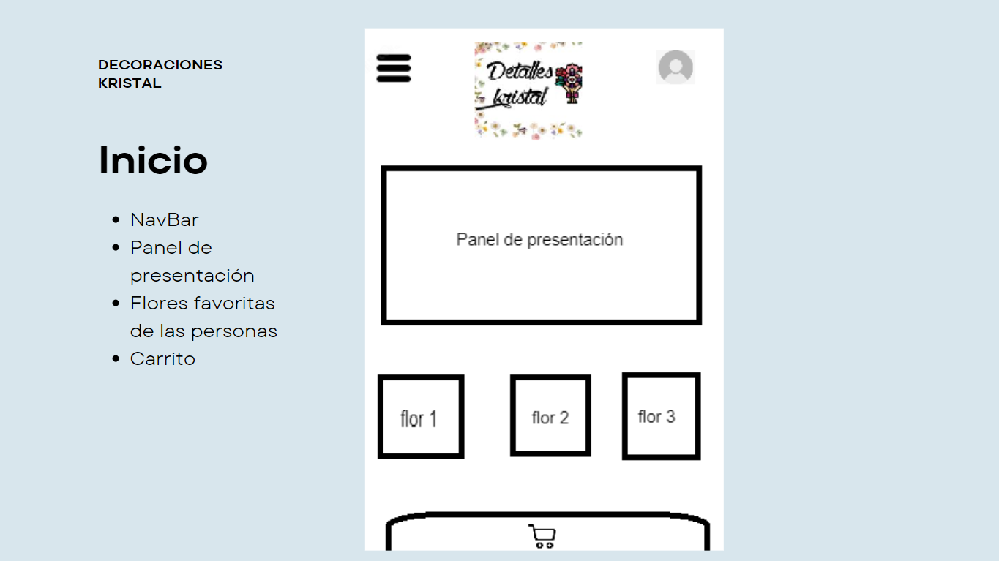
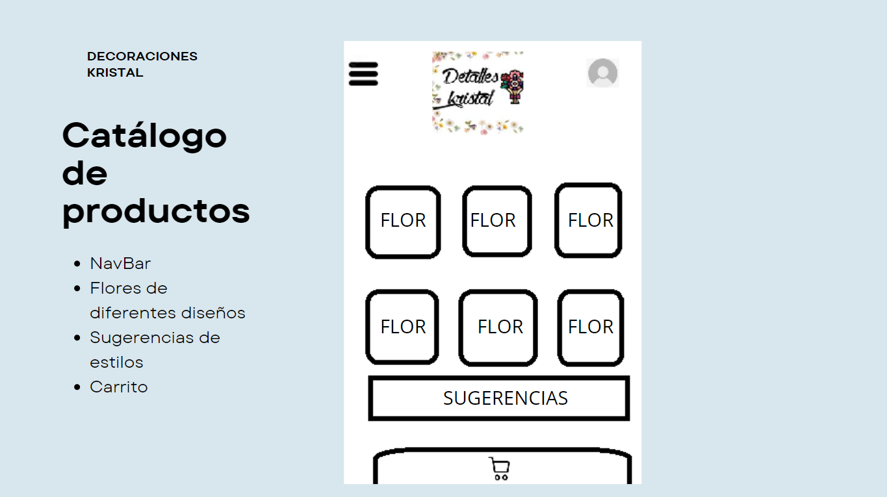
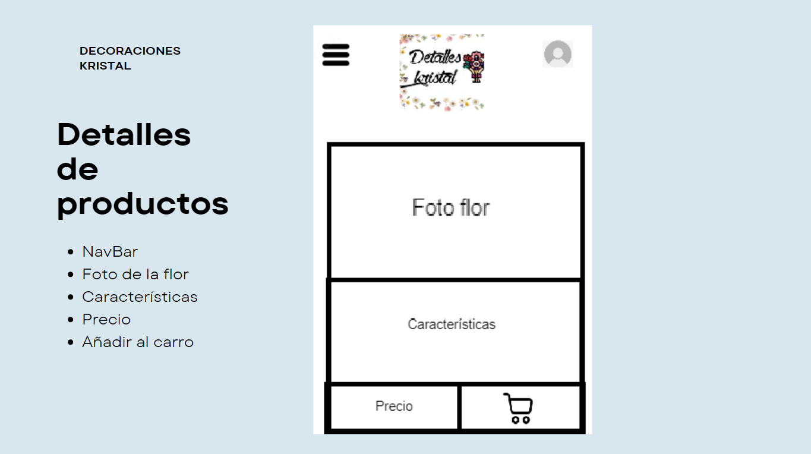
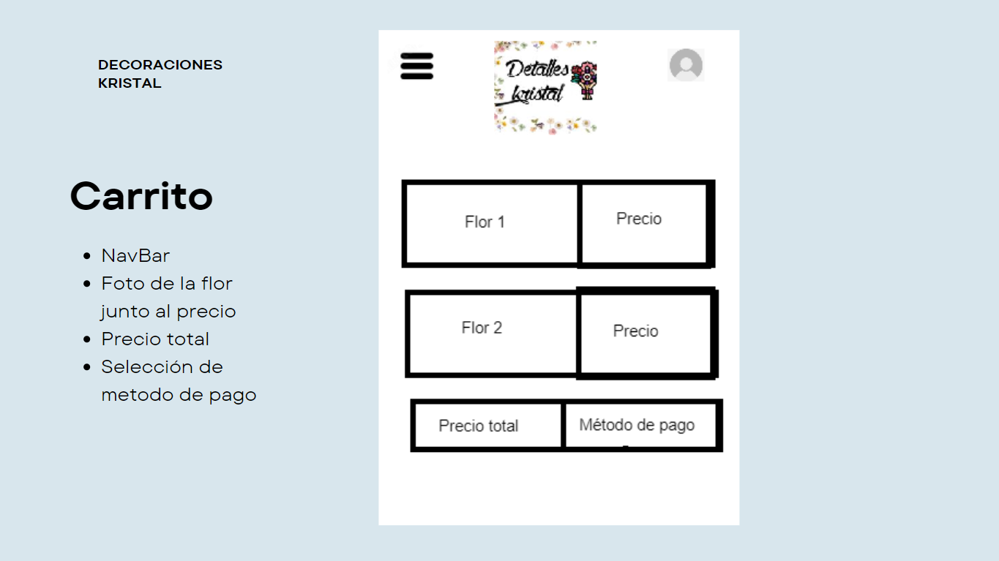
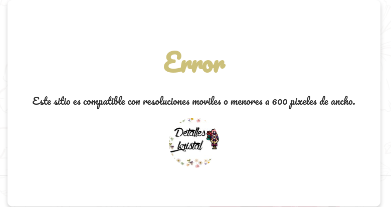

##Página Web-Decoraciones Kristal
En la página inicialmente encontrarás cinco (5) apartados iniciales:

-Uno es el apartado del panel de presentacion en que se mostrará una transición 
de dos presentaciones 
-Otro es el apartado de flores favoritas de las personas
-Otro es el apartado del catálogo encontrando todas las flores disponibles
-El apartado de contacto encontrarás nuestra página de Instagram y numeros de contactow
-Y el apartado del carrito que te direccionará al carrito predetermindado 

##Uso de la página
En la barra de navegación arriba a la izquierda encontrarás formas de ubicarte en el sitio:

-Inicio
-Catálogo
-Contacto

Además cuando vayas a seleccionar una flor te direccionará a los detalles de ese tipo de rosa:

-Para continuar con tu compra debes dar click en el carrito de compra (Añadir al carrito)

Y al finalizar encontras tu carrito predeterminado 🥳:

OJO si la pantalla tiene una resolucion de 600 pixeles o más de ancho mostrará un aviso de resolución (Responsive):

https://www.canva.com/design/DAGH9h1Dq2o/u3QFOwfDJKqIELyz81wi8g/edit
